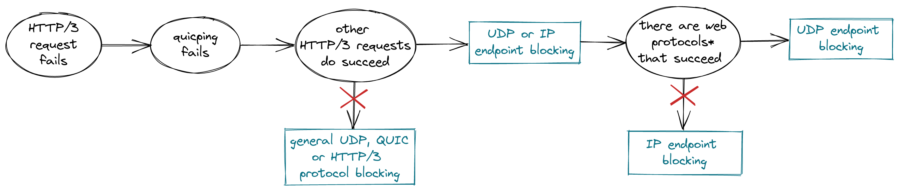

# Documentation on HTTP/3 Censorship Methods

This document contains observed methods of QUIC and HTTP/3 censorship in various countries.

In general, QUIC censorship proofs that censors are continuously adapting and improving their censorship methodologies with the aim to block unwanted website traffic in the *most comprehensive* way. 

## 1. Identification methods
Identification refers to how the censor detects that traffic is directed towards a blacklisted website. This section describes UDP endpoint blocking and SNI blocking as possible HTTP/3 targeting identification methods. IP-blacklisting is not considered here, since it is not targeting HTTP/3 specifically but all IP-based protocol stacks.


### 1.1. UDP endpoint blocking

**What is it?** <br/>
*Blocking that targets certain UDP endpoints.* A UDP endpoint is the unique combination of the IP address and the UDP port used. 
In such a scenario, blocking triggers are at least the IP address and the protocol type (`udp`) and possibly also the 
port number (`443`, for HTTP/3).

UDP endpoint blocking differs from IP blocking in the sense that IP blocking affects all protocols above layer 3. Thus, HTTP/S and HTTP/3 are equally impaired by IP blocking. UDP endpoint blocking targets HTTP/3 more specifically.

UDP endpoint blocking is probably cheap for censors as it does not require Deep Packet Inspection but rather only the inspection of very few IP and UDP header fields. However, since it does not distinguish between multiple services that might be running on the same host, it causes collateral blocking of other websites.

**How to detect it**<br/>



UDP endpoint blocking on itself looks like IP endpoint blocking since both blocking methods are not affected by application layer tampering (e.g. SNI manipulation). Running tests on other protocols helps differentiate the blocking method. <br/>

**Oberserved in**<br/>
Iran, 2021 <br/>
India, 2022 (AS38266)

**Circumvention approaches**<br/>
Unlike TCP, QUIC connections are not bound to a specific network path and IP address. Rather, connections are identified by connection IDs and clients can change IP addresses mid-connection. 

While it is definitely worthwile to explore the potentials of this connection migration feature in terms of censorship circumvention, it is unlikely that it can be used to evade strict IP or UDP endpoint blocking: QUIC expects the paths to stay the same during the handshake and the blocking usually already happens during the handshake.

### 1.2. QUIC SNI blocking (TLS censorship)

**What is it?**</br>
*Blocking that is triggered by forbidden domain names in the SNI (Server Name Indication).* The SNI is a TLS extension that is used in the ClientHello to send the name of the requested server. Since the SNI is not protected by encryption, it is often used by censors to filter HTTPS traffic. 

QUIC uses TLS 1.3 for its cryptographic handshake and is therefore also vulnerable to this kind of censorship. However, there is one difference: While traditional HTTPS carries the SNI in plain cleartext, QUIC Initial packets are protected by connection- and version-specific keys. While an observer of the connection is still capable of decrypting the Initial, QUIC's Initial protection does provide an additional hurdle for censors to parse the SNI and makes SNI-blocking less efficient. 

**How to detect it**<br/>
SNI blocking is detectable by manipulating the SNI in the sent HTTP/3 request: With OONI urlgetter, this can be done by setting the urlgetter option ```-O TLSServerName="example.com"```.
As done [here](https://ooni.org/post/2020-tls-blocking-india/), it is useful to run 4 tests in order to determine whether a certain SNI is blocked:
* a) Choose an uncensored website and send a normal HTTP/3 request to this host to make sure it is in fact uncensored.
* b) Send a normal HTTP/3 GET request to the target host in question. Use the correct SNI, i.e. the domain name of the target. If the SNI of the target is blocked, this will *not* work.
* c) Send an HTTP/3 GET request to the target host with the SNI set to the domain name of the uncensored host chosen in a). If the SNI of the target is blocked, this will work since an uncensored SNI is used.
* d) Send an HTTP/3 GET request to the uncensored host chosen in a) and set the SNI to the domain name of the target host. If the SNI of the target is blocked, this will *not* work.


**Oberserved in**<br/>
India, 2022 (AS133694) <br/>

QUIC-SNI blocking has very rarely been recorded by OONI data so far (March 23, 2022). In most networks where censors use SNI-blocking for TCP-based HTTPS, HTTP/3 is not blocked or blocked via IP/[UDP endpoint blocking](#11-udp-endpoint-blocking). These findings might confirm that it is not trivial for censors to apply the same SNI strategy to QUIC traffic because of its Initial protection.

However, starting March 4, 2022, there have been reports from Russia saying that the SNI was used in some networks to filter HTTP/3 traffic (https://ntc.party/t/http-3-quic/1823, https://github.com/net4people/bbs/issues/108). I was unable to find a vantage point in Russia but further research needs to investigate how Russia censors HTTP/3. 


## 2. Interference methods
Interference methods are means to block or impair connections that have been [identified](#1-identification-methods) to be policy-offending.

### 2.1. Dropping Initial packets - Handshake timeout
**What is it?**</br>
*Dropping, i.e. refusing to relay, network packets during the QUIC handshake.*
This is an [inline technique](https://datatracker.ietf.org/doc/html/draft-irtf-pearg-censorship-05#section-5.2.2) that requires the censor to inspect and handle QUIC Initial packets in near real time.

Measurement data has shown that the dropping of Initial packets usually happens during the very first roundtrip. This indicates that the censor filters out policy-offending packets immediately and might even refrain from keeping state about open connections.

**How to detect it**<br/>
Detectable in ```urlgetter``` measurement report: <br/>
The resulting failure type is a QUIC handshake timeout (OONI: ```generic_timeout_error``` during handshake). In ```network_events``` there is usually not a single successful ```read_from``` operation indicating that the client never got a response from the QUIC server.

**Oberserved in**<br/>
Iran, 2021 <br/>
...


### 2.2. Dropping connection data - Connection timeout
**What is it?**</br>
*Dropping, i.e. refusing to relay, network packets during an established QUIC connection.*
This is an [inline technique](https://datatracker.ietf.org/doc/html/draft-irtf-pearg-censorship-05#section-5.2.2) that requires the censor to handle QUIC packets in near real time.

The dropping of packets mid-connection might be due to a response delay at the censor failing to detect and react to policy-offending traffic immediately. Rather than reacting instantly, the censor would keep state about connections and drop packets once they have been inspected and labeled as forbidden.

**How to detect it**<br/>
Detectable in ```urlgetter``` measurement report: <br/>
The resulting failure type is a QUIC connection timeout (OONI: ```No recent network activity``` after handshake). There is a successful ```quic_handshake_done``` operation in ```network_events``` indicating that the connection was established sucessfully and often there are also a few successful ```read_from``` operations after the handshake before there is no further response from the server.

**Oberserved in**<br/>
Uganda, 2021 <br/>
Uganda, 2022

### 2.3. A word on packet injection
OONI data has not confirmed any HTTP/3 interference method other than timeouts. Specifically, I have not noticed any injected packets causing the QUIC connection or handshake to terminate immediately. 

Injecting packets unnoticed seems difficult to do when you have a closer look at the [RFC](). This is in contrast to TCP where TCP RST packets can be easily injected by a censor that can roughly guess the current packet number. For QUIC, connection termination frames are encrypted and stateless resets have more security mechanisms than TCP RSTs: The stateless reset packet contains a token that is hard to guess and calculated from the connection ID and a static key, for each endpoint respectively. An endpoint only accepts a stateless reset if the reset token matches the agreed-upon token.

If a censor does manage to inject packets that terminate the QUIC connection, we would be able to detect them in the measurement report also: Such a measurement would probably be characterized by a failed read operation and a short runtime because the injected packet would make the client stop sending immediately.